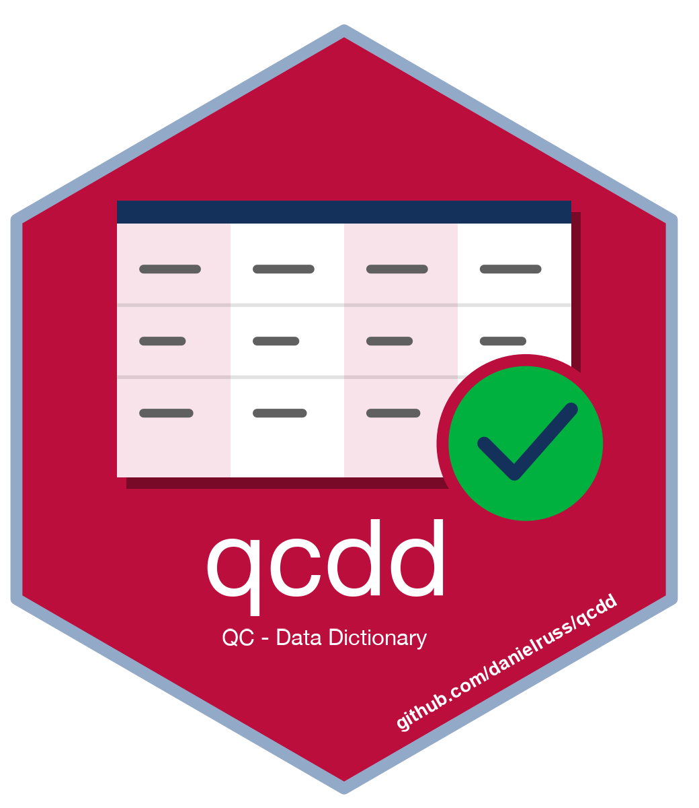

# qcdd 

**QC - Data Dictionary**

`qcdd` builds a concept lookup from a Connect Excel data dictionary containing
multiple concept ID columns and multiple definition columns. After importing the
worksheet, you specify which definition column belongs to each concept ID column.
The package combines those pairs into one lookup for quality assurance and quality
control workflows and flags conflicting definitions for review.

The package is under development as the Connect data dictionary format evolves.

## Installation

Requires R 4.1.0 or later. Install from
[r-universe](https://danielruss.r-universe.dev/qcdd):

```r
install.packages(
  "qcdd",
  repos = c("https://danielruss.r-universe.dev", "https://cloud.r-project.org")
)
```

Alternatively, install from GitHub:

```r
install.packages("remotes") # If needed
remotes::install_github("danielruss/qcdd")
```

## Build a lookup from an Excel dictionary

Start with the Excel workbook containing your data dictionary. Import the relevant
worksheet as text to preserve concept IDs, including any leading zeros. Replace
`dictionary.xlsx` and the sheet name below with your workbook and worksheet.

```r
library(qcdd)

dictionary <- load_dictionary_file(
  "dictionary.xlsx",
  sheet = "dict",
  col_types = "text"
)

names(dictionary)
```

Check the imported column names before selecting them. Repeated Excel headers
such as `conceptId` receive unique names during import, such as `conceptId...3`.
The suffixes depend on the worksheet layout.

My worksheet has the columns shown below, but yours will be different. Use your
own column names and pair each concept ID column with its corresponding definition
column **in the same order**:

| Concept ID column | Definition column |
| --- | --- |
| `conceptId...3` | `Primary Source` |
| `conceptId...5` | `Secondary Source` |
| `conceptId...7` | `Current Source Question` |
| `conceptId...14` | `Current Question Text` |
| `conceptId...23` | `Current Format/Value` |

```r
lookup <- add_concept_ids(
  dictionary,
  concept_ids = c(
    `conceptId...3`, `conceptId...5`, `conceptId...7`,
    `conceptId...14`, `conceptId...23`
  ),
  definitions = c(
    `Primary Source`, `Secondary Source`, `Current Source Question`,
    `Current Question Text`, `Current Format/Value`
  )
)
```

Adjust these names to match your worksheet. Supply bare column names, using
backticks for names containing spaces. The two selections must contain the same
number of columns.

The result combines all selected pairs into two columns, `concept_id` and
`definitions`, with one row per non-missing concept ID. It removes identical
ID-definition pairs and rows with missing IDs (`NA`), and strips leading numeric
value labels such as `1 = ` from definitions. Missing definitions are retained.

## Review conflicts and save the lookup

If one concept ID has different definitions, `add_concept_ids()` issues a warning
and retains the first definition. Column-pair order takes precedence, followed by
row order within each pair; a missing definition can be retained if it comes first.

Inspect the conflicting pairs before using the lookup:

```r
cid_warning(lookup)
```

This returns the conflicting ID-definition pairs, including those retained in the
lookup, or `NULL` when there are no conflicts. The report is stored in the lookup's
`CID_warning` attribute. When conflicts are found, the lookup is ordered by concept
ID groups.

Save the lookup as an RDS file to preserve both the table and its conflict report:

```r
saveRDS(lookup, "concept_lookup.rds")

# Load it in a later session.
lookup <- readRDS("concept_lookup.rds")
```

## License

MIT. See [LICENSE.md](LICENSE.md).
